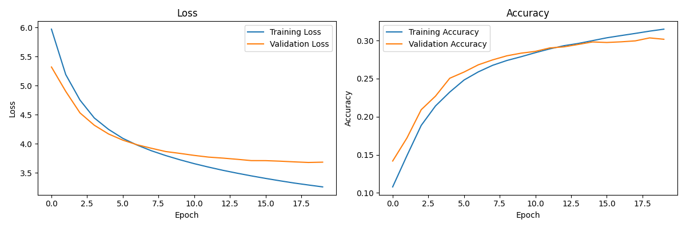

# Image Captioning with Deep Learning
An end-to-end deep learning system that generates natural language descriptions of images using a CNN-LSTM architecture with hyperparameter optimization.

## Table of Contents
- [Features](#features)
- [Architecture](#architecture)
- [Key Parameters](#key-parameters)
- [Hardware Configuration](#hardware-configuration)
- [Results](#results)
- [Common Issues](#common-issues)
- [Hyperparameter Optimization](#hyperparameter-optimization)
- [Production Considerations](#production-considerations)

## Features

- **Multi-model Support**: Choose between DenseNet201, ResNet50, MobileNetV2, or EfficientNetB0 for feature extraction
- **Hyperparameter Optimization**: Automated tuning with Optuna
- **Hardware Optimization**: Automatic GPU/CPU configuration with mixed precision training
- **Memory Efficient**: Custom data generator handles large datasets
- **Visualization**: Training metrics and sample predictions

## Architecture

The system combines two main components:

1. **CNN Encoder** (Feature Extraction):
   - Pre-trained on ImageNet
   - Extracts 2048-dim feature vectors (DenseNet201)
   - Global average pooling final layer

2. **LSTM Decoder** (Caption Generation):
   - Word embedding layer
   - LSTM with attention mechanism
   - Dense layers with dropout
   - Softmax output over vocabulary

```
Input Image → CNN Features → LSTM → Generated Caption
```

## Key Parameters
```
DEFAULT_PARAMS = {
    'embedding_dim': 256,     # Word embedding dimension
    'lstm_units': 256,        # LSTM layer size
    'dropout_rate': 0.5,      # Dropout for regularization
    'learning_rate': 1e-5,    # Initial learning rate
    'batch_size': 32          # Reduce if OOM errors occur
}
```

## Hardware Configuration
The script automatically:
- Enables GPU memory growth
- Sets optimal CPU threading
- Enables XLA compilation

## Results


## Common Issues

1. **CUDA Out of Memory**
   - Reduce batch size (start with 16)
   - Use smaller model (MobileNetV2)
   - Enable gradient accumulation

2. **Slow Training**
   - Verify GPU utilization (`nvidia-smi`)
   - Disable eager execution: `tf.config.run_functions_eagerly(False)`
   - Use `TF_DATA_EXPERIMENT_OPT=1` environment variable

3. **Poor Caption Quality**
   - Increase dataset size
   - Adjust LSTM units (128-512)
   - Try different feature extractors

## Hyperparameter Optimization
Optuna searches:
- LSTM units (128-512)
- Dropout rates (0.1-0.6)
- Learning rates (1e-6 to 1e-3)
- Batch sizes (16-128)

## Production Considerations
- The saved model includes:
  - Architecture definition
  - Trained weights
  - Tokenizer configuration