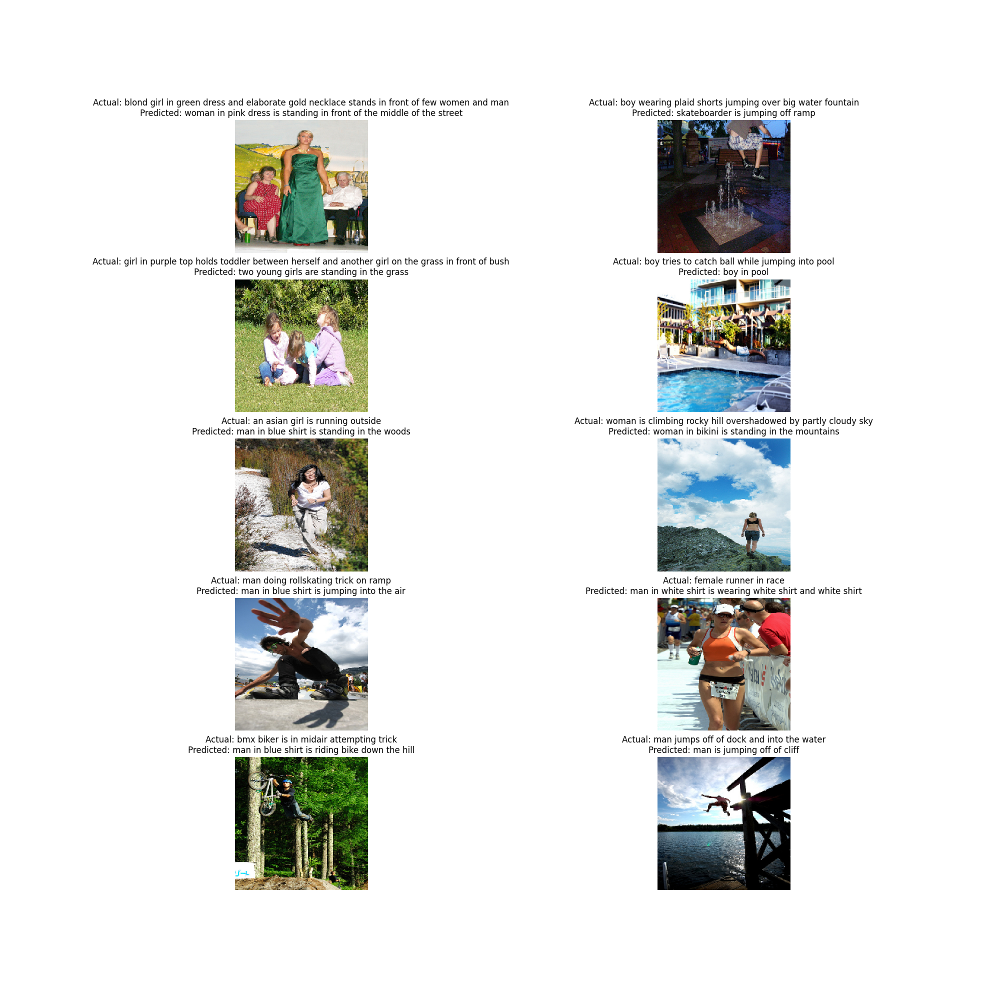

# Image Captioning with CNN-LSTM Architecture



An end-to-end deep learning pipeline that generates natural language descriptions of images, featuring automatic hardware optimization and hyperparameter tuning.

## Table of Contents
- [Key Features](#key-features)
- [System Architecture](#system-architecture)
- [Configuration](#configuration)
- [Troubleshooting](#troubleshooting)
- [Advanced Usage](#advanced-usage)

## Key Features

- **Flexible Backbones**: Switch between DenseNet201 (default), ResNet50, MobileNetV2, or EfficientNetB0
- **Intelligent Training**:
  - Automatic mixed precision training (FP16/FP32)
  - Optuna-powered hyperparameter optimization
  - Memory-efficient data pipeline
- **Production Ready**:
  - Complete model packages (architecture + weights + tokenizer)
  - Training visualization and evaluation metrics
  - GPU/CPU auto-configuration

## System Architecture

### Feature Extraction Pipeline
```
    A [Input Image] --> B[224x224 Normalization]
    B --> C[CNN Feature Extraction]
    C --> D[2048-dim Feature Vector]
```

### Caption Generation
```
    D [Feature Vector] --> E[Word Embedding]
    E --> F[Attention LSTM]
    F --> G[Word Prediction]
    G --> H[Generated Caption]
```

## Configuration

### Core Parameters
| Parameter         | Range          | Default | Description                     |
|-------------------|----------------|---------|---------------------------------|
| `embedding_dim`   | 128-384        | 256     | Word embedding size            |
| `lstm_units`      | 128-512        | 256     | LSTM layer capacity            |
| `dropout_rate`    | 0.1-0.6        | 0.3     | Regularization strength        |
| `batch_size`      | 16-128         | 32      | Adjust based on GPU memory     |


## Troubleshooting

| Symptom               | Solution                                  | Verification               |
|-----------------------|------------------------------------------|----------------------------|
| CUDA Out of Memory    | Reduce batch size, use MobileNetV2       | `nvidia-smi` monitoring    |
| Slow Training         | Enable XLA, verify GPU usage             | Check GPU utilization      |
| Poor Caption Quality  | Increase data, tune LSTM units           | BLEU score evaluation      |

## Advanced Usage

### Hyperparameter Search
```
Optuna explores:
- LSTM units: 128-512
- Learning rates: 1e-6 to 1e-3
- Batch sizes: 16-128
- Dropout rates: 0.1-0.6
```

### Production Deployment
```
Saved model package includes:
- Architecture definition (.keras)
- Trained weights
- Tokenizer configuration (.pkl)
- Example inference script
```
